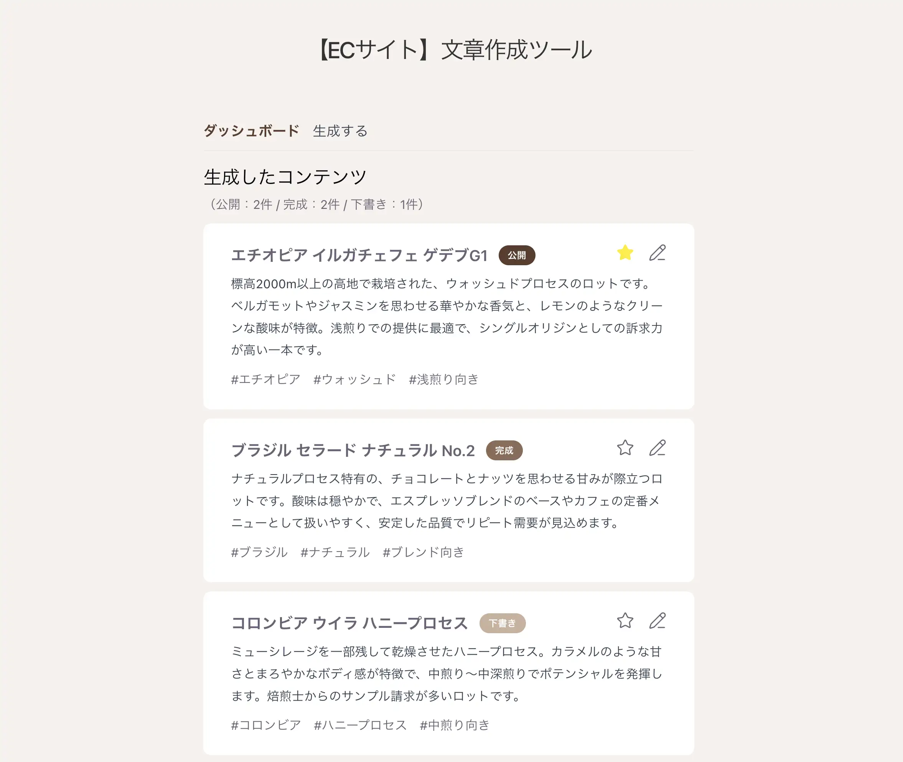

# ①課題名

AIコンテンツ生成ツール（ECサイト文章作成ツール）

## ②課題内容（どんな作品か）

- EC事業者・ショップ担当者向けに、商品説明・キャッチコピー・SNS投稿文・問い合わせ対応文をAIで生成できるツールです。
- 商品名・生産国・生産地・特徴・トーンなどの入力内容をもとに、文章の種類ごとに専用のプロンプトを組み立ててAIに依頼します。
- 生成した文章は「下書き・完成・公開」のステータス、お気に入り、タグを付けてダッシュボードで一覧管理でき、タグをクリックすることで該当タグを持つコンテンツだけに絞り込み表示できます。
- データはブラウザのlocalStorageに保存され、リロードしても内容が保持されます。

## ③アプリのデプロイURL

（未デプロイ・ローカル環境での動作確認のみ）

## ④アプリのログイン用IDまたはPassword（ある場合）

認証機能はありません

## ⑤工夫した点・こだわった点

- お気に入り登録やタグクリックによる絞り込みといったカード単体の操作はカードコンポーネント側の責務にとどめ、状態（絞り込み条件など）は実際に必要な範囲の親コンポーネントに集約する設計を意識しました。

## ⑥難しかった点・次回トライしたいこと（又は機能）

- タグの値を「入力中は文字列・保存時は配列」として扱う際に、状態の型が場面によって揺れてしまいエラーになる不具合が何度か発生し、変換処理のタイミングを1箇所に統一することの大切さを学びました。

## ⑦フリー項目（感想、シェアしたいこと等なんでも）

React学習の一環として、状態管理（useState）・コンポーネント間のprops設計など・API接続などを実装しました。
まだ削除・並び替え機能などがないので、今後、修正を進めて仕上げたいです。
